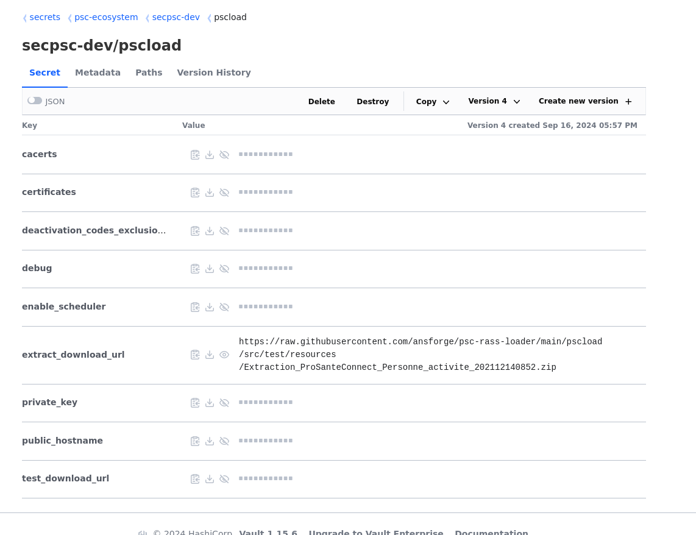

# pscload-v2
pscload V2
Component to load RASS data in psc db

## Developement

### Tool versions

Please note that `psc-rass-loader` depends on deprecated JDK APIs, and the build
breaks from JDK 21 on.
This can be addressed by :
*  Installing a JDK-11 or 17 version (this can be done locally instead of system-wide)
*  Setting up  the JAVA_HOME variable to this JDK version.

### Distribution history

This ecosystem uses many independant components, some of which live an independant life in distinct repositories.
For each release of `psc-ps-api`, [the psc-compoents' distribution  history](https://github.com/ansforge/psc-components/blob/main/DISTRIBUTION.md) 
file will need to be updated with the new version, so that we can keep track of compatible component versions, 
and go back to a previous working distribution if need be.

### Release procedure

Whenever a version is ready for release, run the following commands on the `main` branch (or on the maintenance branch if we're about to issue a production FIX). This should run on any shell, be it `bash`, `cmd` or if needed `gitbash`.

```bash
mvn release:prepare -DautoVersionSubmodules=true -DtagNameFormat=@{version}
git push
git push origin <new_version_tag>
```

where `<new_version_tag>` stands for the new version.

Eg to relase `1.0.1` :

```bash
mvn release:prepare -DautoVersionSubmodules=true -DtagNameFormat=@{version}
git push
git push origin 1.0.1
```

## Troubleshooting

For trouble shooting see the [DEBUG](DEBUG.md) section.

## Qualification

To help qualification, two test datasets have been added (see below).

To use extract files from these datasets, set the psload key `extract_download_url` in Vault for the instance to `https://raw.githubusercontent.com/ansforge/psc-rass-loader/main/pscload/src/test/resources/<dataset_name>/<extract name>`. For example, to use the `BaseExtract.zip` extract from dataset **qualif-extracts**, use : https://raw.githubusercontent.com/ansforge/psc-rass-loader/main/pscload/src/test/resources/qualif-extracts/BaseExtract.zip


### qualif-extracts

This datasets consists in 3 extracts (see the [qualif-extracts directory](pscload/src/test/resources/qualif-extracts))
around 100,000 data lines :

*   **BaseExtract.zip** : full 100,000 dataset to use as reference.
*   **Extract_20.000_deletes.zip** : BaseExtract.zip with 20.000 les identities. This will trigger 20.000 deletes (and siwtching back to `BaseExtract.zip` will trigger 20000 creates). 20.000 dletes are 20% deleted lines and will trigger an alert (but 20000 creates won't)
*   **Extract_400Changes.zip** : this will trigger 400 updates (no alert as this is less than 5% change)
*   **Extract_400Deletes.zip** : this will trigger 400 deletes (no alert as this is less than 5% change)

### CT-AMAR

This dataset consists in 3 extracts and 2 CSV files, in order (see the [CT-AMAR directory](pscload/src/test/resources/CT-AMAR)):

1.  **0-RAZ.zip** : first extract, used to wipe the database.
1.  **1-CREATES.zip** : second extract, used to create reference identities.
1.  **2_Correspondance_ADELI_RPPS_creates.csv** : this file defines identity toggles (should be loaded through the add toggle action in the admin portal).
1.  **3-UPDATES.zip** : this triggers updates on some identities
1.  **4_Correspondance_ADELI_RPPS_modifications.csv** : this file defines updates in toggles, to be loaded throug the add toggle action in the admin portal.